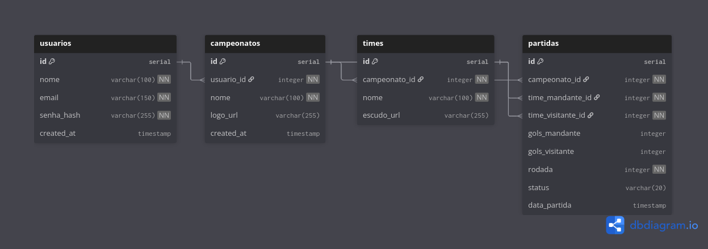

# Placar.IO

Sistema web para gerenciar campeonatos esportivos no formato de pontos corridos. A ideia é substituir planilhas, com um painel para o organizador administrar a liga e uma página pública para quem quiser acompanhar a classificação.

## Funcionalidades

- Cadastro e login de organizadores
- Criação de campeonatos com nome, esporte e logo
- Cadastro de times
- Geração automática de rodadas via Round Robin
- Inserção e atualização de placares
- Tabela de classificação calculada automaticamente (pontos, V/E/D, saldo de gols)
- Página pública com URL compartilhável, sem necessidade de login

## Tecnologias

- Frontend: React, Vite, Tailwind CSS
- Backend: Node.js
- Banco de dados: PostgreSQL

## Banco de Dados

Quatro entidades principais:

1. **Usuários** — administram os campeonatos
2. **Campeonatos** — configurações gerais da liga
3. **Times** — equipes participantes
4. **Partidas** — confrontos e placares

